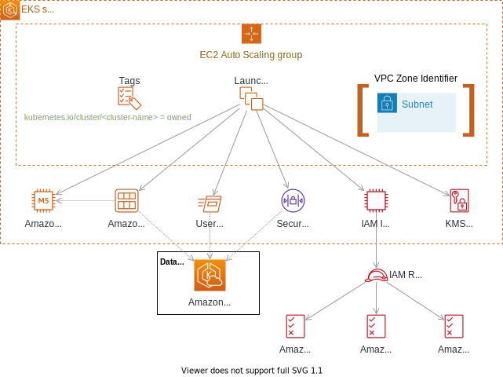

# Amazon EKS Self-Managed Node Group Terraform Module

*Create [Amazon Elastic Kubernetes Service (Amazon EKS)](https://aws.amazon.com/eks) self-managed node groups on AWS using [HashiCorp Terraform](https://www.hashicorp.com/products/terraform).*

This Terraform module is as a simple example that illustrates the AWS resources involved in deploying Amazon EKS self-managed node groups. You can deploy Amazon EKS self-managed node groups in AWS Regions and on [AWS Outposts](https://aws.amazon.com/outposts/).

There is a more sophisticated [terraform-aws-eks](https://registry.terraform.io/modules/terraform-aws-modules/eks/aws) module on the Terraform registry, which allows you to create and manage Amazon EKS clusters along with managed and self-managed node groups and Fargate profiles. The terraform-aws-eks module's [code](https://github.com/terraform-aws-modules/terraform-aws-eks) is more complex to read and understand. With that complexity, the registry module provides more functionality and flexibility than this sample code module.

You should using this sample code module for learning and educational purposes. Once you understand how to construct self-managed node groups from the basic AWS resources, you can create your own Terraform configurations or use the terraform-aws-eks module to save time.

## Usage

This module contains the required resources to deploy an *Amazon EKS self-managed node group* on AWS.

To allow the nodes to register with your EKS cluster, you will need to configure the [AWS IAM Authenticator](https://github.com/kubernetes-sigs/aws-iam-authenticator) (`aws-auth`) ConfigMap with the node group's IAM role and add the role to the `system:bootstrappers` and `system:nodes` Kubernetes RBAC groups. You can use the [kubernetes]() Terraform provider and the [`kubernetes_config_map`]() resource to manage the `aws-auth` ConfigMap for your cluster (see the [`aws-auth-config-map.tf`]() file in the example configurations).

### Deploy an Amazon EKS self-managed node group in an AWS Region

```terraform
module "eks_self_managed_node_group" {
  source = "github.com/aws-samples/amazon-eks-self-managed-node-group"

  eks_cluster_name = "cmluns-eks-cluster"
  instance_type    = "m5.2xlarge"
  desired_capacity = 2
  min_size         = 1
  max_size         = 4
  subnets          = ["subnet-0aeebfca3d1a6da83", "subnet-0e407d26b34566b16"] # Region subnet(s)

  node_labels = {
    "node.kubernetes.io/node-group" = "node-group-a" # (Optional) node-group name label
  }
}
```

See the [`examples/region/`](./examples/region/) directory for the full configuration.

## Deploy an Amazon EKS self-managed node group on an AWS Outpost

```terraform
module "eks_self_managed_node_group" {
  source = "../.."

  eks_cluster_name = "cmluns-eks-cluster"
  instance_type    = "m5.2xlarge"
  desired_capacity = 1
  min_size         = 1
  max_size         = 1
  subnets          = ["subnet-0afb721a5cc5bd01f"] # Outposts subnet(s)

  node_labels = {
    "node.kubernetes.io/outpost"    = "op-0d4579457ff2dc345" # (Optional) Outpost ID label
    "node.kubernetes.io/node-group" = "node-group-a"         # (Optional) node-group name label
  }

  # Outposts require that you encrypt all EBS volumes
  ebs_encrypted   = true
  ebs_kms_key_arn = "arn:aws:kms:us-west-2:799838960553:key/0e8f15cc-d3fc-4da4-ae03-5fadf45cc0fb"
}
```

See the [`examples/outposts/`](./examples/outposts) directory for the full configuration.

## Terraform resources



| Name                                                                                                                                     | Type        |
| ---------------------------------------------------------------------------------------------------------------------------------------- | ----------- |
| [aws_autoscaling_group](https://registry.terraform.io/providers/hashicorp/aws/latest/docs/resources/autoscaling_group)                   | resource    |
| [aws_launch_template](https://registry.terraform.io/providers/hashicorp/aws/latest/docs/resources/launch_template)                       | resource    |
| [aws_iam_instance_profile](https://registry.terraform.io/providers/hashicorp/aws/latest/docs/resources/iam_instance_profile)             | resource    |
| [aws_iam_role](https://registry.terraform.io/providers/hashicorp/aws/latest/docs/resources/iam_role)                                     | resource    |
| [aws_iam_role_policy_attachment](https://registry.terraform.io/providers/hashicorp/aws/latest/docs/resources/iam_role_policy_attachment) | resource    |
| [aws_ami](https://registry.terraform.io/providers/hashicorp/aws/latest/docs/data-sources/ami)                                            | data source |
| [aws_eks_cluster](https://registry.terraform.io/providers/hashicorp/aws/latest/docs/data-sources/eks_cluster)                            | data source |
| [aws_ec2_instance_type](https://registry.terraform.io/providers/hashicorp/aws/latest/docs/data-sources/ec2_instance_type)                | data source |

## Module inputs

### Required

- `eks_cluster_name` - The name of the Amazon EKS cluster.
- `instance_type` - The EC2 instance type to use for the worker nodes.
- `desired_capacity` - The desired number of nodes to create in the node group.
- `min_size` - The minimum number of nodes to create in the node group.
- `max_size` - The maximum number of nodes to create in the node group.
- `subnets` - A list of subnet IDs to launch nodes in. Subnets automatically determine which availability zones the node group will reside.

### Optional

- `name` - The name to be used for the self-managed node group. By default, the module will generate a unique name.
- `name_prefix` - Creates a unique name beginning with the specified prefix. Conflicts with `name`.
- `tags` - Tags to apply to all tag-able resources.
- `node_labels` - Kubernetes labels to apply to all nodes in the node group.
- `key_name` - The name of the EC2 key pair to configure on the nodes.
- `security_group_ids` - A list of security group IDs to associate with the worker nodes. The module automatically associates the EKS cluster security group with the nodes.
- `ebs_encrypted` - Enables EBS encryption on the volume. By default, the module uses the setting from the selected AMI.
- `ebs_kms_key_arn` - The ARN of the AWS Key Management Service (AWS KMS) to use when creating the encrypted volume. `encrypted` must be set to true when this is set.
- `ebs_volume_size` - The EBS volume size for a worker node. By default, the module uses the setting from the selected AMI.
- `ebs_volume_type` - The EBS volume type for a worker node. By default, the module uses the setting from the selected AMI.
- `ebs_iops` - The amount of provisioned IOPS for a worker node. This must be set with an `ebs_volume_type` of `io1` or `io2`.
- `ebs_throughput` - The throughput to provision for a `gp3` volume in MiB/s (specified as an integer).
- `ebs_delete_on_termination` - Whether the worker node EBS volumes should be destroyed on instance termination. By default, the module uses the setting from the selected AMI.

## Module outputs

- `name` - The full name of the self-managed node group.
- `role_arn` - The ARN of the node group IAM role.
- `ami_id` - The ID of the selected Amazon EKS optimized AMI.
- `ami_name` - The name of the selected Amazon EKS optimized AMI.
- `ami_description` - The description of the selected Amazon EKS optimized AMI.
- `ami_creation_date` - The creation date of the selected Amazon EKS optimized AMI.


Copyright Amazon.com, Inc. or its affiliates. All Rights Reserved.
